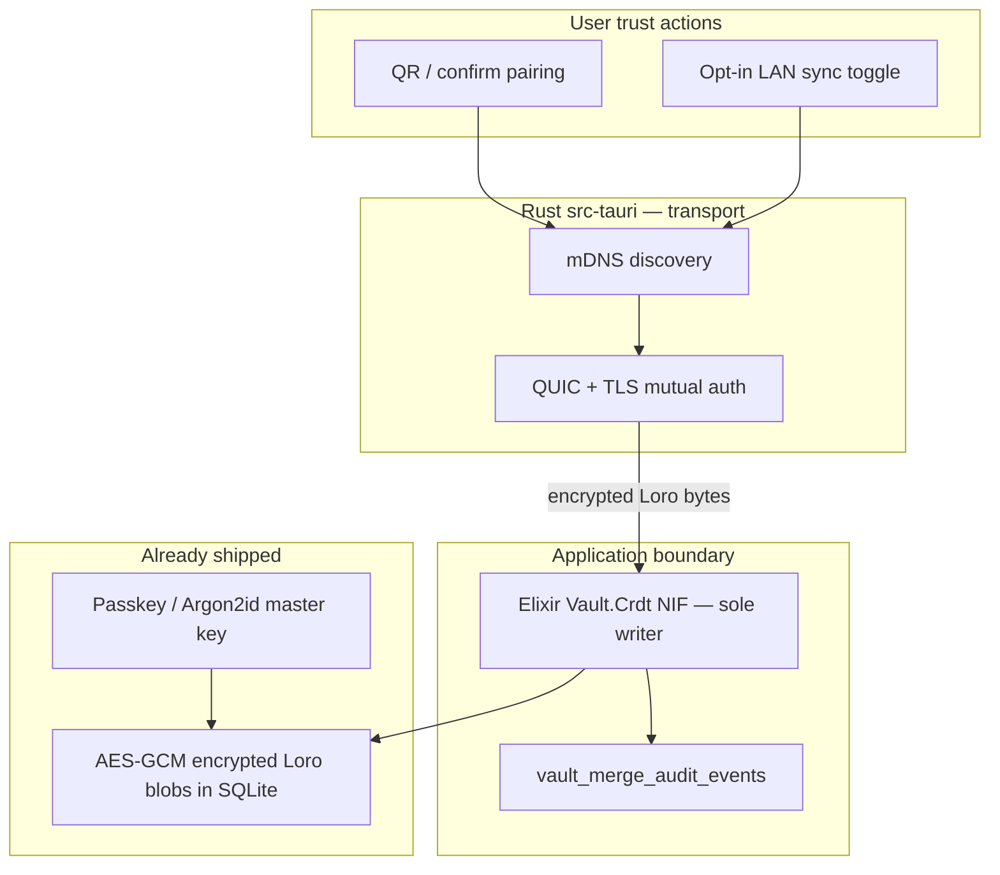

# WiFi / LAN P2P sync — security model

Security and trust boundaries for **SuchConfig desktop** device-to-device sync on a **local network only** (Wi‑Fi or wired LAN). This is the authoritative **public** security reference for the P2P feature. Delivery maturity: [public-alpha-roadmap.md](../public-alpha-roadmap.md). Parallel durability path: [trusted-folder-sync.md](../features/trusted-folder-sync.md).

**Product promise:** vault configuration and secrets **never** traverse SuchConfig-hosted infrastructure. LAN sync is **opt-in**, **local-only** (no internet relay), and **explicitly paired** before any replication bytes move between machines.

Public Alpha: pairing + Handoff are dogfood-verified; incremental deltas and some transport hardening remain open.

---

## Design stance

| Principle | SuchConfig behavior |
| --------- | ------------------- |
| **Local-first sovereignty** | Each device keeps a full encrypted SQLite + Loro store; LAN is an acceleration layer, not the source of truth ([data sovereignty](../concepts/data-sovereignty.md)). |
| **No vendor vault server** | Discovery and transport are **direct** between user-owned desktops on the subnet; no upload path to SuchConfig. |
| **Trust before transport** | Pairing pins **Ed25519 device keys** out-of-band (QR / signed JSON) **before** mDNS sessions or delta exchange are accepted ([Step 2 shipped](../features/p2p-pairing-plus-recovery.md)). |
| **Rust owns the wire** | mDNS, QUIC/TCP, pairing crypto, and framing live in `src-tauri`; **one writer** to vault rows remains Elixir + `Vault.Crdt` NIF. |
| **Same merge contract as archives** | Loro bytes applied through the same import/audit paths as `.suchvault` and Trusted Folder — no second ad-hoc merge format. |
| **Defense in depth** | Device signatures (authentication) + AES-256-GCM session frames + vault-unlock gate + at-rest passkey encryption; passkey never on the wire; plaintext SQLite never leaves the process. Transit *confidentiality* against passive capture is pending the key-agreement fix — see [Current confidentiality limitation](#current-confidentiality-limitation-raw-tcp-stack). |

---

## Threat model (summary)

**In scope**

- Rogue or curious devices on the **same LAN** (coffee-shop Wi‑Fi, shared office subnet).
- Stale or replayed pairing payloads.
- User mistake (pairing with the wrong machine).
- Corporate **AP isolation** or VPN blocking device-to-device traffic (availability, not confidentiality breach).

**Out of scope / not mitigated by LAN P2P alone**

- Compromise of a **already-paired** device (attacker has full local vault access).
- Physical access to an unlocked app session.
- Malware on the host with user privileges (same trust boundary as any local password manager).
- Nation-state interception **outside** the LAN segment.

**Assumptions**

- Users only enable WiFi / LAN sync on networks they treat as **trusted enough for device pairing** (home, team office), consistent with Anytype [local-only](https://doc.anytype.io/anytype-docs/advanced/data-and-security/self-hosting/local-only) posture.
- Global vault encryption (passkey / master key) remains required for decrypt at rest.

---

## Industry-aligned practices

SuchConfig’s P2P design follows patterns common in **local-first**, **password-manager**, and **mesh sync** products:

| Practice | Standard / precedent | SuchConfig implementation |
| -------- | -------------------- | ------------------------- |
| **Out-of-band pairing** | Signal safety numbers; QR / short-code device link patterns | Signed **pairing offer/response** over QR or manual JSON paste; **6-character short code** for human verification |
| **Asymmetric device identity** | TLS certs, SSH host keys, WireGuard public keys | **Ed25519** long-lived device keypair per install ([RFC 8032](https://www.rfc-editor.org/rfc/rfc8032)) |
| **Mutual authentication** | mTLS, Noise IK, SPAKE2 | Offer and response **signed** by initiator/responder keys; initiator verifies response before storing peer |
| **Short-lived enrollment** | OAuth state, pairing TTL | Pairing sessions expire after **10 minutes** (`SESSION_TTL_SECS`) |
| **Pinning trusted peers** | Certificate pinning, SSH `known_hosts` | `peers.json` stores **pinned Ed25519 public keys** per paired `device_id` |
| **Encrypted replication** | E2EE sync (Anytype, Syncthing-class) | All frames AES-256-GCM via the session cipher. **Handoff** snapshots keep item *values* as passkey-encrypted `crdt_snapshot_encrypted` blobs (metadata is plaintext in the JSON envelope); **incremental deltas** carry plaintext Loro updates protected only by the session layer. Transport key agreement (X25519/QUIC) is the open item — see [Current confidentiality limitation](#current-confidentiality-limitation-raw-tcp-stack) |
| **Least privilege on network** | Bind to LAN, no cloud fallback | **LAN-only** sync plane; no SuchConfig relay; user-operated Trusted Folder as parallel path |
| **Audit without leakage** | SOC2-friendly activity logs | `vault_merge_audit_events` records **counts and metadata**, not secret bodies ([tracking causality](../concepts/tracking-causality.md)) |
| **Explicit consent** | Opt-in sync toggles | Pairing wizard requires **Confirm** on responder; initiator completes with response verification |

---

## Shipped today — Step 2: pairing & device key store

**Status:** implemented in `src-tauri/src/p2p/` (June 2026). **Does not yet** move vault CRDT bytes over the network — it establishes **trust** for Steps 3–5.

### Pairing protocol (v1)

1. **Initiator** generates ephemeral `session_id`, **6-char short code**, and a **signed pairing offer** (`kind: "pairing_offer"`, version `v: 1`).
2. **Responder** validates offer signature, expiry, and short code; user confirms device name.
3. **Responder** signs **pairing response** (`kind: "pairing_response"`) and stores initiator as a **pinned peer**.
4. **Initiator** verifies response signature and session binding, then stores responder as a **pinned peer**.

Canonical string formats for signatures (domain-separated to prevent cross-protocol replay):

```
suchconfig-pair-offer-v1|{session_id}|{device_id}|{public_key_b64}|{expires_at}
suchconfig-pair-response-v1|{session_id}|{initiator_device_id}|{responder_device_id}|{public_key_b64}
```

### On-disk artifacts

| File | Content | Permissions |
| ---- | ------- | ----------- |
| `{app_data}/p2p/device.json` | Device UUID, display name, Ed25519 public + secret key (base64) | `0600` on Unix |
| `{app_data}/p2p/peers.json` | Map of paired `device_id` → pinned public key, `paired_at`, `pinned: true` | `0600` on Unix |

Secret keys are generated with **`OsRng`** (CSPRNG). Pairing rejects self-pairing, duplicate peers, invalid signatures, and expired sessions.

### Device identity vs. vault master key (authoritative)

These are **two separate keys** and the distinction is deliberate:

| Key | Scope | Lifetime | Gates |
| --- | ----- | -------- | ----- |
| **Ed25519 device key** (`device.json`) | Identifies *this install* on the LAN; signs pairing + handshake | Generated once at install with `OsRng`; persists | Network trust (who may connect) |
| **Vault master key** (passkey / Argon2id) | Decrypts vault contents at rest | Per unlock session | Data access (whether bytes can be read/applied) |

The device key is **not derived from the vault/passkey unlock** — it exists before any vault is unlocked so discovery and pairing can work, and it survives lock/unlock cycles. Confidentiality is preserved by a **second, independent gate**: LAN sync only moves vault bytes when the vault is **unlocked** on both peers (the handshake authenticates the *device*; the unlock gate authorizes *data*). A compromised device key alone therefore grants LAN reachability and trust, **not** plaintext vault access.

> Note: earlier wording in [p2p-wifi-sync-best-practices.md](../features/p2p-wifi-sync-best-practices.md) §4 implied the device identity is "derived from the passkey unlock flow." That is a target-architecture aspiration, **not** the shipped model — the shipped model is the two-key split above. Treat this table as authoritative.

### Handshake fingerprint logging

On every successful mutual handshake, **both peers log the other's pinned Ed25519 public-key fingerprint** (SHA-256, first 8 bytes, hex) — never the key bytes themselves. This makes wrong-peer and impersonation attempts auditable from `[suchconfig-p2p]` logs and lets a tester compare the logged fingerprint against the value shown in **Settings → WiFi / LAN devices**. A fingerprint that does not match the pinned peer is treated as a `handshake` failure even if the cryptographic exchange completes (the resolved endpoint is not the paired device).

### Rust libraries — shipped (Step 2)

| Crate | Version (manifest) | Role |
| ----- | ---------------- | ---- |
| [**ed25519-dalek**](https://docs.rs/ed25519-dalek) | `2` | Ed25519 signing and verification for device identity and pairing payloads |
| [**rand**](https://docs.rs/rand) | `0.8` | `OsRng` for key generation (via ed25519-dalek) and short-code entropy |
| [**uuid**](https://docs.rs/uuid) | `1` | Version-4 device and session identifiers |
| [**serde**](https://docs.rs/serde) / [**serde_json**](https://docs.rs/serde_json) | `1` | Versioned, typed pairing offer/response JSON |
| [**base64**](https://docs.rs/base64) | `0.22` | Key and signature encoding in JSON (standard alphabet) |
| [**qrcode**](https://docs.rs/qrcode) | `0.14` | QR encoding of offer/response JSON for OOB transfer |
| [**image**](https://docs.rs/image) | `0.25` (PNG only) | QR rasterization to PNG for LiveView display |
| [**parking_lot**](https://docs.rs/parking_lot) | `0.12` | In-memory pairing session map (mutex) |
| [**chrono**](https://docs.rs/chrono) | `0.4` | ISO8601 `paired_at` timestamps |
| [**hostname**](https://docs.rs/hostname) | `0.4` | Default human-readable device name |

**Why Ed25519:** widely deployed (SSH, Signal, TLS 1.3 ecosystem), fast, compact keys, and well-audited Rust implementations. It is the same curve family recommended for modern device identity when X.509 ceremony is unnecessary at pairing time.

---

## Planned — Steps 3–5: discovery, transport, replication

**Status:** not shipped; security requirements are fixed here so implementation can be reviewed against this doc.

### Discovery (Step 3)

| Crate (planned) | Role |
| --------------- | ---- |
| [**mdns-sd**](https://docs.rs/mdns-sd) | Multicast DNS advertise/query for `_suchconfig._tcp.local` on the LAN |

**Rules:** mDNS exposes **only** paired or in-progress **session metadata** (device id, ephemeral port) — **never** vault content. **Anonymous mDNS responders are not trusted** for delta exchange until mutual pairing and session crypto complete.

### Transport (Steps 4–5)

| Crate (planned) | Role |
| --------------- | ---- |
| [**tokio**](https://docs.rs/tokio) | Async runtime for network I/O (already in `Cargo.toml`) |
| [**quinn**](https://docs.rs/quinn) | QUIC over UDP — encrypted, multiplexed streams; industry-standard datagram security |

**Rules:**

- Bind listeners to **LAN interfaces** only; no SuchConfig-hosted relay or internet fallback.
- **Mutual authentication** using pinned peer keys from Step 2 (TLS client/server certs or equivalent derived from device identity — final wire format TBD).
- Rate limits and framed messages; fuzzing and soak tests before RC.

### Vault payload encryption (reuse — not new crypto)

LAN replication carries the **same encrypted Loro snapshot bytes** already used elsewhere in SuchConfig:

| Crate (existing) | Role |
| ---------------- | ---- |
| [**aes-gcm**](https://docs.rs/aes-gcm) | AES-256-GCM for `.loro.enc` and archive envelopes |
| [**argon2**](https://docs.rs/argon2) | Argon2id key derivation (Trusted Folder / vault master key) |
| [**sha2**](https://docs.rs/sha2) | SHA-256 sidecars for backup integrity |
| [**keyring**](https://docs.rs/keyring) | OS keychain integration for vault wrapped keys (macOS / Linux / Windows) |

Merge semantics stay in **`suchconfig_vault_core` / Loro** via the Elixir NIF — Rust P2P **must not** apply CRDT merges directly ([project-vault-CRDT-usage.md](../local-first/project-vault-CRDT-usage.md)).

---

## Current confidentiality limitation (raw-TCP stack)

**Severity: high — must fix before any release beyond two-device, single-owner dogfood.** Documented openly so it is reviewed, not assumed away.

**What is solid today:** *authentication*. The mutual Ed25519 challenge/response over **pinned** keys means an on-LAN attacker cannot impersonate a paired device or man-in-the-middle the session — they cannot sign the challenge nonce without a pinned private key, and unpaired devices are rejected (`HandshakeReject`).

**What is not solid today:** *confidentiality against a passive eavesdropper*. The session key is computed as:

```
session_key = SHA-256( SESSION_KEY_DOMAIN ‖ sorted(signature_initiator, signature_responder) )
```

Both signatures are sent in **cleartext** `handshake_response` frames *before* the cipher exists (the key is derived from them afterward). An attacker who **records the full session** therefore has both signatures and can recompute `session_key`, then decrypt every AES-256-GCM frame. Practical exposure by path:

| Path | Exposure if a recorded session is decrypted |
| ---- | -------------------------------------------- |
| **Handoff** (Step 4) | Item **metadata** (titles, kinds, folder structure) — values stay passkey-encrypted (`crdt_snapshot_encrypted`) |
| **Incremental delta** (Step 5) | **Plaintext secret/config values** (`Crdt.diff_from` runs on decrypted Loro snapshots) |

This is a classic "derived a key from transmitted material instead of agreeing on a secret" mistake. It does **not** weaken authentication or the at-rest passkey encryption, and the passkey is never on the wire.

**Remediation (one of):**

1. **Ephemeral X25519 ECDH inside the signed handshake** (near-term, keeps raw TCP): each side sends an ephemeral X25519 public key, signs it with its device Ed25519 key; the session key is the ECDH shared secret, which is **never transmitted** and gives forward secrecy. Add constant-time comparisons and fingerprint binding at the same time.
2. **iroh / QUIC transport swap** (Step 8): TLS 1.3 supplies authenticated key agreement + forward secrecy natively, retiring the bespoke derivation.

Until one lands, treat LAN sync as **opt-in dogfood on a trusted network you own** (its current default-off posture). See [public-alpha-roadmap.md](../public-alpha-roadmap.md).

---

## Layered security (end state)



---

## Operational guidance for users and testers

- Pair only on networks you control or trust; treat **short codes** like pairing PINs.
- **Remove** stale peers from Settings when a device is decommissioned.
- Prefer **Trusted Folder** for off-LAN or air-gapped backup; LAN P2P complements it, does not replace it.
- If AP isolation blocks sync, use archive export or Trusted Folder — not a bypass through SuchConfig cloud (none exists).

Manual pairing / LAN checks are founder UAT scripts (not published in Public Alpha docs).

---

## Hardening backlog (Phase D)

Still open for Public Alpha / later tags:

- Fuzz pairing JSON and future framing parsers.
- Replay resistance review for LAN delta batches (nonces / frontiers tied to Loro `oplog_vv`).
- Downgrade attack tests (reject unauthenticated plaintext sync).
- **Authenticated key agreement (confidentiality fix — see [Current confidentiality limitation](#current-confidentiality-limitation-raw-tcp-stack)):** replace today's derive-key-from-signatures scheme with an **ephemeral X25519 ECDH** exchange inside the signed handshake (device Ed25519 key signs the ephemeral pubkeys). The session key becomes a shared secret that is **never transmitted** — closing the passive-eavesdropper gap and giving **forward secrecy** as a side effect. The QUIC/iroh transport swap (Step 8) delivers TLS 1.3 key agreement + forward secrecy for free and is the alternative path.
- **Constant-time comparison:** verify challenge/nonce and any MAC/tag checks with constant-time equality (`subtle::ConstantTimeEq` or equivalent), never `==` on byte slices, to avoid timing oracles on the handshake path.
- **Handshake fingerprint binding:** assert the connected peer's Ed25519 fingerprint equals the pinned `peers.json` value before deriving the session key (defends against endpoint reuse / impersonation; see Handshake fingerprint logging above).
- Sleep/wake and multicast failure soak tests; **background-listener** survival under macOS App Nap / hardened runtime, Windows power throttling, Linux session lock.
- External security review before public LAN sync RC.

---

## Related documents

- [trusted-folder-sync.md](../features/trusted-folder-sync.md) — parallel encrypted backup path
- [public-alpha-roadmap.md](../public-alpha-roadmap.md) — Public Alpha maturity
- [SECURITY.md](../../SECURITY.md) — repo-root security policy
